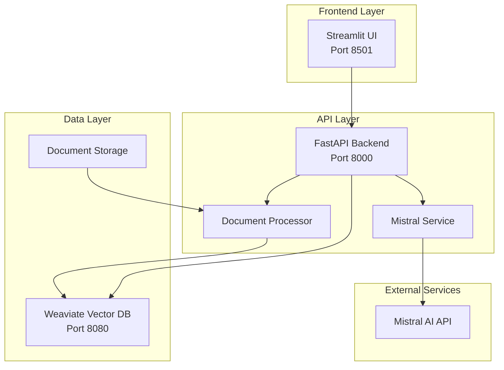

# RAG Chatbot Project

A production-ready Retrieval-Augmented Generation (RAG) chatbot system using state-of-the-art technologies.

## 🚀 Features

- **Multi-format Document Processing**: Support for PDF, DOCX, and TXT files
- **Hybrid Search**: Combines BM25 keyword search with vector similarity search
- **Advanced LLM Integration**: Uses Mistral AI's latest models for response generation
- **Real-time Chat Interface**: Interactive Streamlit-based UI with chat history
- **RESTful API**: Comprehensive FastAPI backend with automatic documentation
- **Containerized Deployment**: Full Docker Compose setup for easy deployment
- **Document Management**: Upload, process, and manage knowledge base documents
- **Source Attribution**: Responses include references to source documents

## 🏗️ Architecture



## 🛠️ Tech Stack

- **LLM**: Mistral AI API (mistral-large-latest)
- **Vector Database**: Weaviate with hybrid search capabilities
- **Backend**: FastAPI with async support
- **Frontend**: Streamlit with custom UI components
- **Document Processing**: PyPDF2, python-docx, LangChain text splitters
- **Infrastructure**: Docker Compose for orchestration
- **Search**: BM25 + Vector similarity hybrid search

## 📁 Project Structure

```
rag-chatbot/
├── backend/                    # FastAPI backend service
│   ├── app/
│   │   ├── api/               # API route handlers
│   │   │   └── routes/        # Individual route modules
│   │   ├── core/              # Core configuration
│   │   ├── models/            # Pydantic models
│   │   └── services/          # Business logic services
│   ├── requirements.txt
│   └── Dockerfile
├── frontend/                   # Streamlit frontend
│   ├── app.py                 # Main Streamlit application
│   ├── requirements.txt
│   └── Dockerfile
├── documents/                  # Document storage
│   └── uploads/               # Uploaded files directory
├── scripts/                    # Utility scripts
│   ├── setup.sh              # Setup and installation script
│   └── test.sh               # Testing script
├── docker-compose.yml         # Service orchestration
├── .env.example              # Environment variables template
├── .gitignore
└── README.md
```

## 🚀 Quick Start

### Prerequisites

- Docker and Docker Compose installed
- Mistral AI API key ([Get one here](https://console.mistral.ai/))

### Installation

1. **Clone the repository**
   ```bash
   git clone <repository-url>
   cd rag-chatbot
   ```

2. **Run the setup script**
   ```bash
   chmod +x scripts/setup.sh
   ./scripts/setup.sh
   ```

3. **Configure environment variables**
   ```bash
   cp .env.example .env
   # Edit .env and add your Mistral API key
   nano .env
   ```

4. **Start the services**
   ```bash
   docker-compose up -d
   ```

5. **Access the application**
   - **Frontend UI**: http://localhost:8501
   - **API Documentation**: http://localhost:8000/docs
   - **Backend API**: http://localhost:8000
   - **Weaviate Console**: http://localhost:8080

### Manual Setup

If you prefer manual setup:

```bash
# 1. Create environment file
cp .env.example .env

# 2. Edit .env file with your Mistral API key
MISTRAL_API_KEY=your_api_key_here

# 3. Build and start services
docker-compose build
docker-compose up -d

# 4. Check service health
docker-compose ps
```

## 🧪 Testing

Run the comprehensive test suite:

```bash
./scripts/test.sh
```

This will test:
- Service connectivity
- API endpoints
- Document processing
- Chat functionality
- Health checks

## 📖 Usage

### Document Upload

1. Access the Streamlit UI at http://localhost:8501
2. Use the sidebar to upload PDF, DOCX, or TXT files
3. Documents are automatically processed and indexed

### Chat Interface

1. Type your questions in the chat input
2. The system will search relevant documents and generate responses
3. View source documents used for each response
4. Chat history is maintained per session

### API Usage

The backend provides a comprehensive REST API:

```python
import requests

# Upload a document
with open('document.pdf', 'rb') as f:
    response = requests.post(
        'http://localhost:8000/documents/upload',
        files={'file': f}
    )

# Send a chat message
response = requests.post(
    'http://localhost:8000/chat/',
    json={
        'message': 'What is this document about?',
        'use_history': True
    }
)

# Search documents
response = requests.get(
    'http://localhost:8000/search/',
    params={'q': 'search query', 'limit': 5}
)
```

## 🔧 Configuration

### Environment Variables

| Variable | Description | Default |
|----------|-------------|---------|
| `MISTRAL_API_KEY` | Mistral AI API key | Required |
| `MISTRAL_MODEL` | Mistral model to use | `mistral-large-latest` |
| `WEAVIATE_URL` | Weaviate database URL | `http://weaviate:8080` |
| `MAX_FILE_SIZE_MB` | Maximum upload file size | `50` |
| `CHUNK_SIZE` | Text chunk size for processing | `1000` |
| `CHUNK_OVERLAP` | Overlap between text chunks | `200` |
| `LOG_LEVEL` | Logging level | `INFO` |

### Customization

- **Modify chunk size**: Adjust `CHUNK_SIZE` and `CHUNK_OVERLAP` for different document types
- **Change search parameters**: Modify hybrid search alpha value in the code
- **Add new file formats**: Extend the document processor service
- **Custom UI**: Modify the Streamlit frontend in `frontend/app.py`

## 🔍 API Documentation

### Endpoints

#### Health Check
- `GET /health/` - Service health status
- `GET /health/ready` - Readiness probe
- `GET /health/live` - Liveness probe

#### Document Management
- `POST /documents/upload` - Upload and process documents
- `POST /documents/upload-multiple` - Upload multiple documents
- `DELETE /documents/{document_id}` - Delete a document
- `GET /documents/stats` - Get document statistics
- `GET /documents/supported-formats` - List supported formats

#### Search
- `GET /search/` - Search documents (GET method)
- `POST /search/` - Search documents (POST method)
- `POST /search/bm25` - BM25-only search
- `POST /search/hybrid` - Hybrid search with custom alpha

#### Chat
- `POST /chat/` - Send chat message
- `GET /chat/sessions/{session_id}/history` - Get chat history
- `DELETE /chat/sessions/{session_id}` - Clear chat session
- `GET /chat/sessions` - List all sessions
- `POST /chat/summarize` - Summarize conversation
- `POST /chat/feedback` - Submit feedback

### Response Formats

All API responses follow consistent formats with proper error handling and status codes.

## 🐛 Troubleshooting

### Common Issues

1. **Backend not starting**
   - Check if Mistral API key is set in `.env`
   - Verify Weaviate is running: `docker-compose logs weaviate`

2. **Document upload fails**
   - Check file size limits
   - Verify supported file formats
   - Check backend logs: `docker-compose logs backend`

3. **Chat responses are slow**
   - This is normal for the first request (cold start)
   - Check Mistral API rate limits
   - Monitor backend logs for errors

4. **Search returns no results**
   - Ensure documents are uploaded and processed
   - Check Weaviate data: visit http://localhost:8080

### Debugging Commands

```bash
# View all service logs
docker-compose logs -f

# Check service status
docker-compose ps

# Restart services
docker-compose restart

# Rebuild and restart
docker-compose down
docker-compose build
docker-compose up -d

# Access backend container
docker-compose exec backend bash

# Check Weaviate data
curl http://localhost:8080/v1/objects
```

## 🚀 Production Deployment

### Security Considerations

1. **Environment Variables**: Use proper secret management
2. **API Keys**: Rotate keys regularly
3. **Network**: Configure proper firewall rules
4. **HTTPS**: Use reverse proxy with SSL certificates
5. **Authentication**: Add user authentication if needed

### Scaling

1. **Horizontal Scaling**: Run multiple backend instances
2. **Load Balancing**: Use nginx or similar
3. **Database**: Consider Weaviate cluster for high availability
4. **Monitoring**: Add logging and monitoring solutions

### Performance Optimization

1. **Caching**: Implement response caching
2. **Async Processing**: Use background tasks for document processing
3. **Connection Pooling**: Optimize database connections
4. **Resource Limits**: Set appropriate Docker resource limits

## 🤝 Contributing

1. Fork the repository
2. Create a feature branch
3. Make your changes
4. Add tests if applicable
5. Submit a pull request

## 📄 License

This project is licensed under the MIT License - see the LICENSE file for details.

## 🙏 Acknowledgments

- [Mistral AI](https://mistral.ai/) for the language model
- [Weaviate](https://weaviate.io/) for the vector database
- [FastAPI](https://fastapi.tiangolo.com/) for the backend framework
- [Streamlit](https://streamlit.io/) for the frontend framework
